# Delivery System (Back-end)

# Présentation

Le système doit permettre la gestion de livreurs, de tournées et de livraisons.

**Delivery System (Back-end)** est [API](https://fr.wikipedia.org/wiki/API) [REST](https://fr.wikipedia.org/wiki/Representational_state_transfer) qui permet la gestion de livreurs, de tournées et de livraisons.

## Prévisualisation

Le front-end est situé dans le dépôt Delivery_System_Front_End dont voici quelques prévisualisation.

### Thème

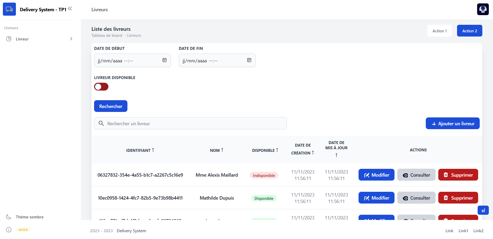
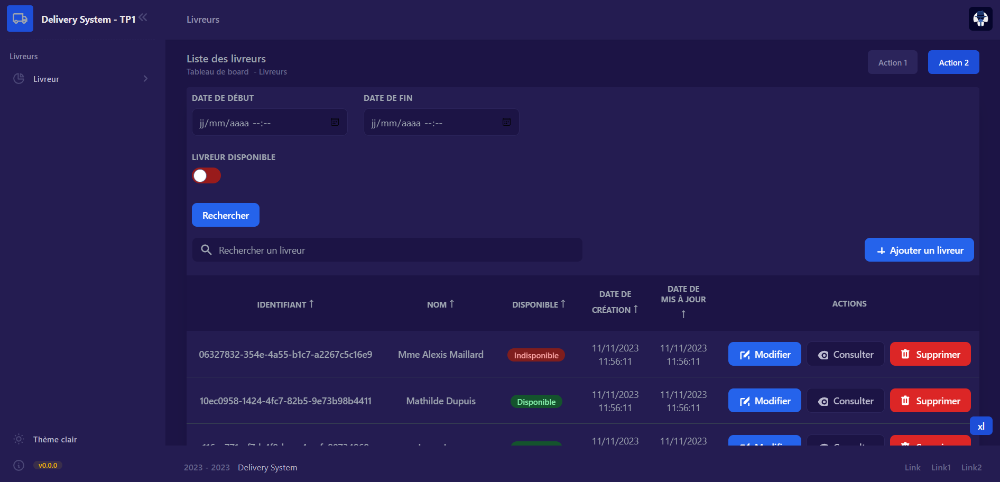

### Livreur
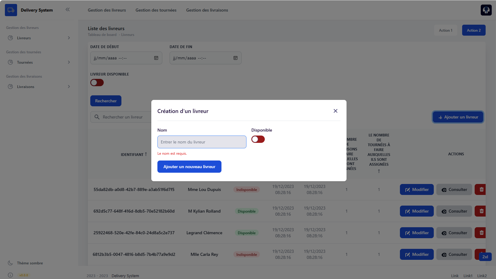
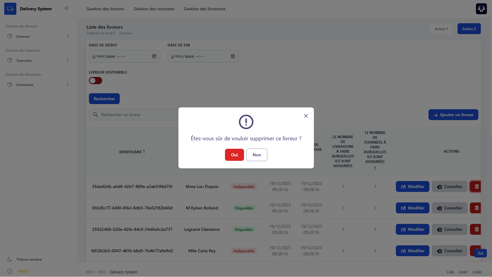
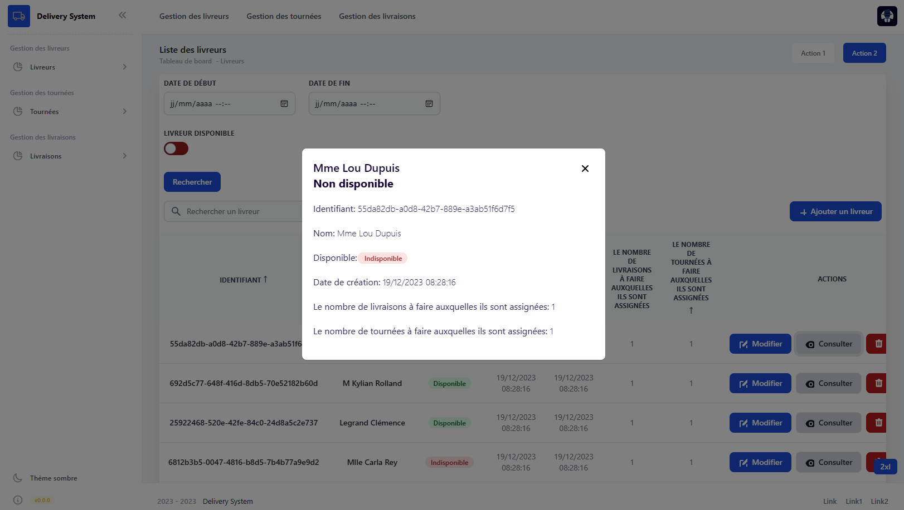
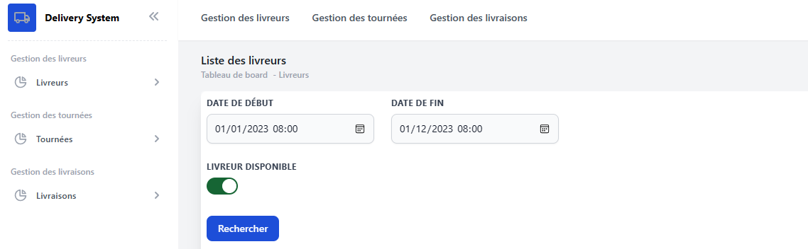
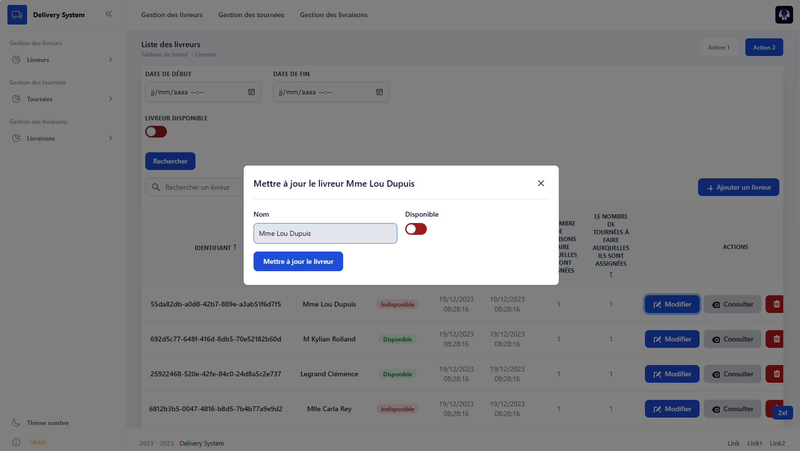

### Tournée
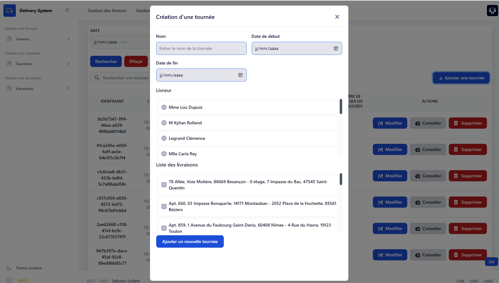
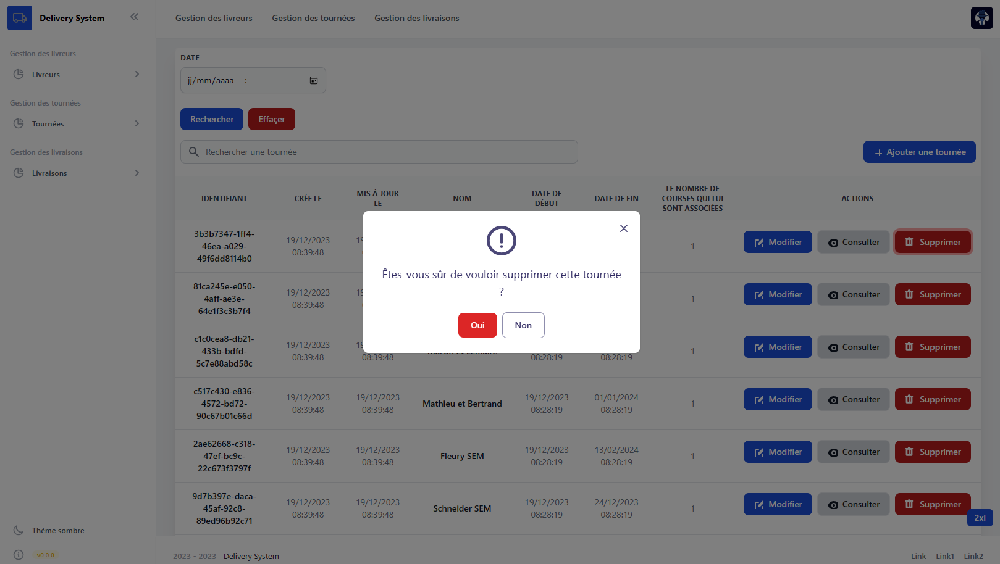
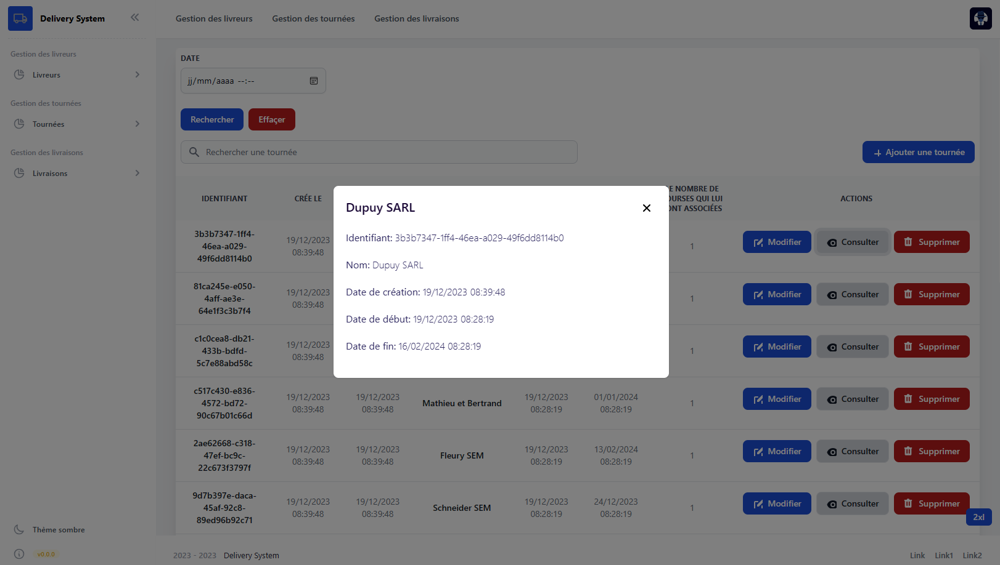
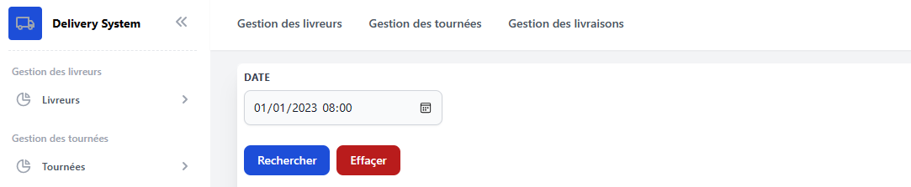
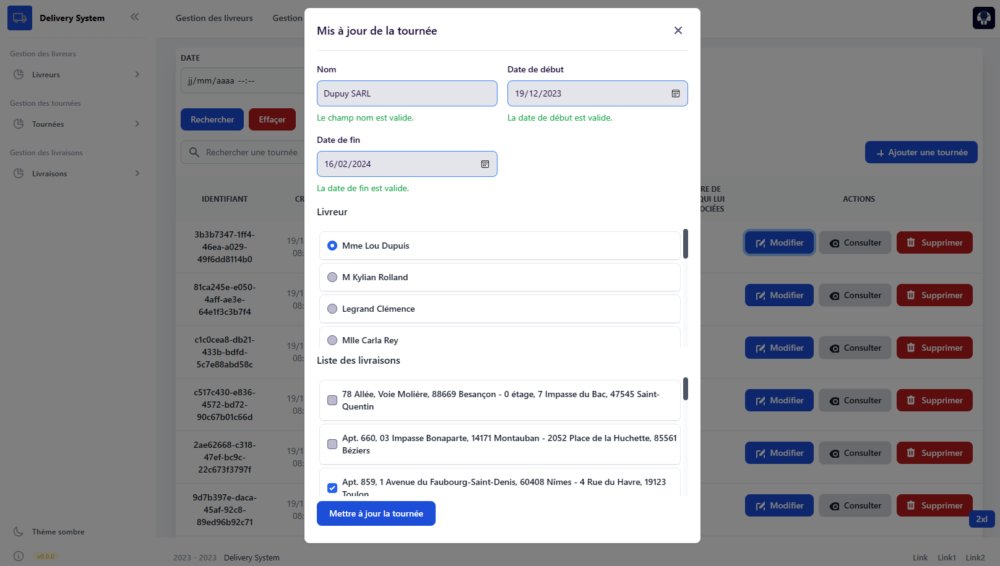

### Livraison
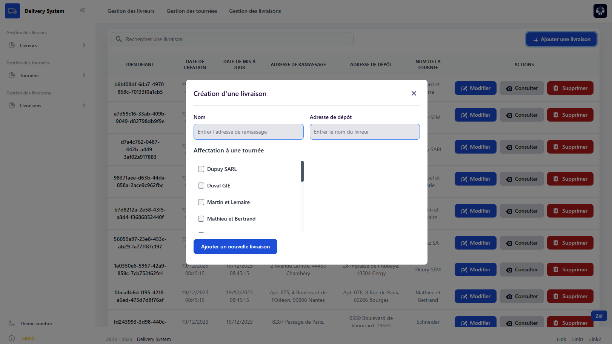
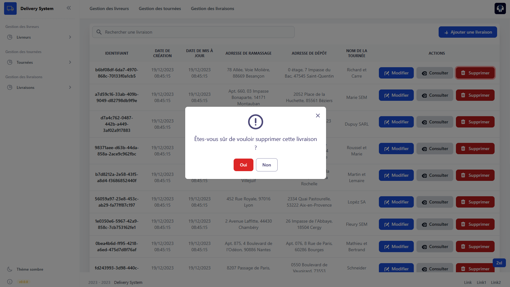
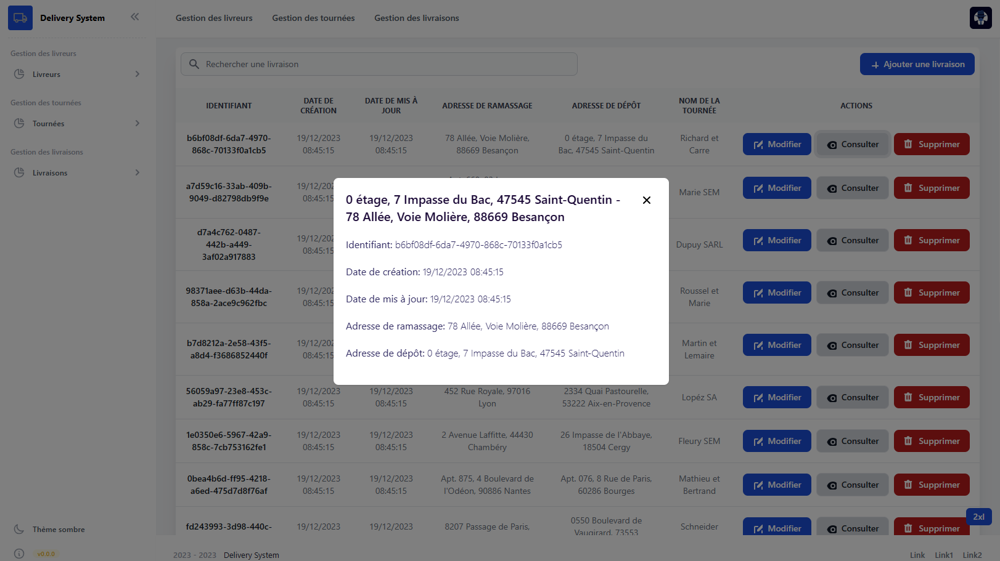
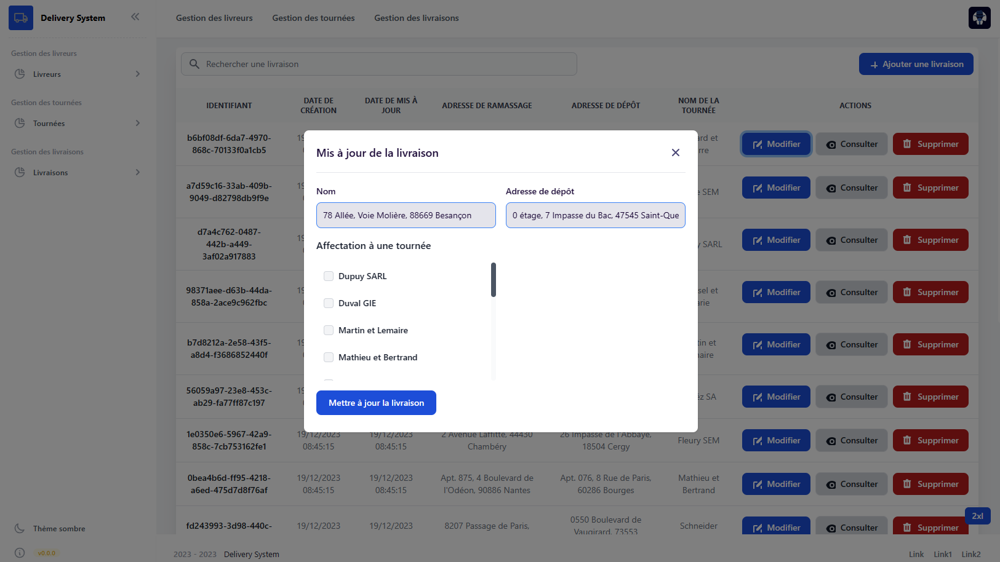

# Installation

1. Clonez ce référentiel sur votre machine locale.
2. Ouvrez un terminal et naviguez vers le répertoire du projet.

## Configuration du fichier d'environnement (.env)

Afin d'utiliser l'application, il y a deux modes d'utilisations, soit en ayant les outils installées sur sa machine ou soit en utilisant docker, le fichier `.env` doit être adapter en fonction de votre mode d'utilisation:
En local :
```shell
SPRING_HOST=127.0.0.1
POSTGRES_HOST=127.0.0.1
ADMINER_HOST=127.0.0.1
```
Avec docker :
```
SPRING_HOST=0.0.0.0
POSTGRES_HOST=0.0.0.0 
ADMINER_HOST=0.0.0.0
```

## Installation avec Docker

Avant de commencer, assurez-vous que le client PostgreSQL est fermé sur votre machine, car il pourrait bloquer l'utilisation de certains ports utilisés par Docker.

### Étape 1 : Compilation et création du JAR

Pour construire le JAR de l'application, suivez ces étapes :

1. Ouvrez un terminal.
2. Assurez-vous qu'il n'y a pas d'erreurs dans le code.
   ```shell
   ./mvnw compile
   ```

3. Créez le JAR en exécutant la commande suivante. Le JAR généré sera utilisé dans le fichier Dockerfile.
   ```shell
   ./mvnw clean package -DskipTests
   ```

### Étape 2 : Build et démarrage des conteneurs Docker

Pour construire et démarrer les conteneurs Docker, exécutez la commande suivante :

```shell
docker-compose up --build
```

Pour arrêter les conteneurs Docker, exécutez la commande suivante :
```shell
docker-compose up --build
```

Après l'exécution de cette commande, les conteneurs suivants seront démarrés :

- Spring Boot : [http://localhost:8080/](http://localhost:8080/)
- PostgreSQL : Port 5432
- Adminer : [http://localhost:8081/](http://localhost:8081/)

**Adminer** est disponible à l'adresse [http://localhost:8081/](http://localhost:8081/). Assurez-vous que PostgreSQL est en cours d'exécution pour utiliser Adminer.

Voici les informations de connexion pour Adminer :
- Système : PostgreSQL
- Serveur : localhost
- Nom d'utilisateur : user_delivery_system
- Mot de passe : user_delivery_system

Si vous avez Docker, veuillez fermer Docker ou arrêter les conteneurs qui pourraient utiliser les mêmes ports.

Informations supplémentaires :
Veuillez noter que la variable ```SPRING_DATASOURCE_URL``` est écrasée :
Lorsque l'application s'exécute dans un environnement Docker, elle utilise la valeur spécifiée dans le fichier compose.yml pour SPRING_DATASOURCE_URL, qui est ensuite récupérée dans le fichier application.properties.
En revanche, lorsque l'application est exécutée localement, c'est-à-dire sans Docker, elle utilise directement la valeur définie dans le fichier .env pour SPRING_DATASOURCE_URL, qui est ensuite intégrée dans le fichier application.properties.

## Installation sans Docker

1. **Java Development Kit 17 (JDK 17) :**
   - Vous avez besoin du kit de développement Java 17 installé sur votre système pour compiler et exécuter des applications Java.
   - Téléchargez et installez la dernière version du JDK à partir du [site officiel d'Oracle](https://www.oracle.com/java/technologies/javase-downloads.html) ou choisissez une version open-source comme OpenJDK.

2. **Spring Boot 3.0 :**
   - Spring Boot simplifie le développement d'applications Java. Vous pouvez l'obtenir en ajoutant les dépendances Spring Boot à votre projet ou en téléchargeant l'interface de ligne de commande Spring Boot (Spring Boot CLI).
   - Vous pouvez ajouter les dépendances Spring Boot en les configurant dans vos fichiers de construction Maven ou Gradle.

3. **Apache Maven :**
   - Apache Maven est un outil d'automatisation de construction utilisé pour gérer les dépendances du projet et le cycle de vie de la construction. Il est couramment utilisé avec les projets Java.
   - Vous pouvez télécharger et installer Maven depuis le [site officiel d'Apache Maven](https://maven.apache.org/download.cgi).

4. **Base de données PostgreSQL :**
   - PostgreSQL est un puissant système de gestion de base de données relationnelle open-source. Vous en aurez besoin pour stocker les données de votre application.
   - Vous pouvez télécharger et installer PostgreSQL depuis le [site officiel de PostgreSQL](https://www.postgresql.org/download/).

5. **Adminer (facultatif) :**
   - Adminer est un outil léger de gestion de base de données qui peut vous aider à interagir avec votre base de données PostgreSQL. Il s'agit d'un outil facultatif mais peut être très utile pendant le développement.
   - Vous pouvez installer Adminer en extrayant l'image Docker officielle et en l'exécutant en tant que conteneur. Plus de détails sont disponibles [ici](https://hub.docker.com/_/adminer).


Les variables d'environnement dans le fichier .env sont les mêmes, ce qui vous permet de choisir entre une utilisation locale avec les outils PostgreSQL, Spring, etc. installés sur votre machine, ou une utilisation avec Docker.


1. Assurez-vous d'avoir PostgreSQL installé et d'avoir ajouté PostgreSQL à votre variable d'environnement PATH.
2. Vous pouvez maintenant démarrer le serveur en suivant ces étapes :

```
pg_ctl start -D "D:\PostgreSQL\data"
```
Le D:\PostgreSQL\data est le répertoire des données, il est souvent définit par la variable d'environnement PGDATA.
Vous devez adapter le chemin si celui-ci ne correspond pas.

Pour arrêter le serveur :
```
pg_ctl stop -D "D:\PostgreSQL\data"
```

Avec le compte par défaut (postgres), vous devez commençer par crée l'utilisateur user_delivery_system ainsi que sa base de données :
```bash
psql -U postgres -h 127.0.0.1 -p 5432
```
```sql
postgres=# <commande>
```
Maintenant, vous êtes connecté avec l'utilisateur postgres, vous pouvez entrer votre commande SQL.

```sql
CREATE USER user_delivery_system WITH PASSWORD 'user_delivery_system';
```

```sql
ALTER USER user_delivery_system WITH SUPERUSER;
```

```sql
CREATE DATABASE delivery_system;
```
```sql
\q
```
```sql
psql -U user_delivery_system -d delivery_system
```

Se connecter à l'utilisateur crée et créer la base de données.
```bash
psql -U <username> -d <database> -h <hostname or IP> -p <port>
```
```bash
psql -U user_delivery_system -d delivery_system -h 127.0.0.1 -p 5432
```
```sql
CREATE DATABASE delivery_system;
```

Lancement de l'application :
```bash
cd delivery_system_back_end
```
```bash
mvn spring-boot:run
```
**Avec Docker :**

Si vous avez Docker, veuillez fermer Docker ou arrêter les conteneurs qui pourraient utiliser les mêmes ports.

Informations complémentaires :
A noter que la variable est écrasé :
SPRING_DATASOURCE_URL :
Quand c'est Docker, alors il utilise celle du compose.yml puis se recuperer dans le application properties.
Quand c'est en local (sans docker), il utilise direct dans le .env SPRING_DATASOURCE_URL qui est direct inséré dans application properties.

## Utilisation

Une fois l'application déployée, vous pouvez accéder à l'API REST pour gérer les commandes, les clients, les livreurs, etc. Assurez-vous de consulter la documentation de l'API pour connaître les points de terminaison et les méthodes disponibles.

# Documentation de l'API

Le documentation de l'API (swagger) est consultable à cette adresse : 
http://localhost:8080/swagger-ui/index.html

## Tests

Tests unitaires :
```bash
mvn -Dtest=DriverControllerUnitTest test
```

Tests d'intégrations :
```bash
mvn -Dtest=DriverIntegrationTest test
```

## Endpoints

| Controller | Full Endpoint | HTTP Method | Parameters | Example |
|-----------------------|---------------|-------------|------------|---------|
| DriverController     | `/api/delivery_system/drivers`    | GET         |               | `http://localhost:8080/api/delivery_system/drivers/all`
| DriverController     | `/api/delivery_system/drivers`    | GET         | `pageable`, `sortBy`, `sortOrder`               | `http://localhost:8080/api/delivery_system/drivers?page=1&size=5&sortBy=createdAt&sortOrder=desc` |
| DriverController     | `/api/delivery_system/drivers`    | POST        | JSON Request Body                               | `POST /api/delivery_system/drivers`           |
| DriverController     | `/api/delivery_system/drivers/search` | GET         | `pageable`, `available`, `createdAtAfter`, `createdAtBefore`, `createdAtFrom`, `createdAtTo`, `sortBy`, `sortOrder` | `/api/delivery_system/drivers/search` |
| DriverController     | `/api/delivery_system/drivers/{id}` | GET         | `id` (Path Variable)                           | `/api/delivery_system/drivers/123`            |
| DriverController     | `/api/delivery_system/drivers/{id}` | PUT         | `id` (Path Variable), JSON Request Body         | `PUT /api/delivery_system/drivers/123`        |
| DriverController     | `/api/delivery_system/drivers/{id}` | DELETE      | `id` (Path Variable)                           | `DELETE /api/delivery_system/drivers/123`     |
| RoundController    | `/api/delivery_system/rounds/all`        | GET         |                                                                                                            | `http://localhost:8080/api/delivery_system/rounds/all`           |
| RoundController    | `/api/delivery_system/rounds`            | GET         | `pageable`, `sortBy`, `sortOrder`                                                                          | `http://localhost:8080/api/delivery_system/rounds?page=1&size=5&sortBy=createdAt&sortOrder=desc`                             |
| RoundController    | `/api/delivery_system/rounds`            | POST        | JSON Request Body                                                                                          | `POST /api/delivery_system/rounds`                              |
| RoundController    | `/api/delivery_system/rounds/search`     | GET         | `pageable`, `available`, `createdAtAfter`, `createdAtBefore`, `createdAtFrom`, `createdAtTo`, `sortBy`, `sortOrder` | `/api/delivery_system/rounds/search`                           |
| RoundController    | `/api/delivery_system/rounds/test/{id}`  | GET         | `id` (Path Variable)                                                                                       | `/api/delivery_system/rounds/test/123`                         |
| RoundController    | `/api/delivery_system/rounds`            | PUT         | `id` (Path Variable), JSON Request Body                                                                    | `PUT /api/delivery_system/rounds/123`                          |
| RoundController    | `/api/delivery_system/rounds`            | DELETE      | `id` (Path Variable)                                                                                       | `DELETE /api/delivery_system/rounds/123`                       |
| DeliveryController    | `/api/delivery_system/deliveries/all`       | GET         |                                                                                                            | `http://localhost:8080/api/delivery_system/deliveries/all`    |
| DeliveryController    | `/api/delivery_system/deliveries`           | GET         | `pageable`, `sortBy`, `sortOrder`                                                                          | `http://localhost:8080/api/delivery_system/deliveries?page=1&size=5&sortBy=createdAt&sortOrder=desc`                     |
| DeliveryController    | `/api/delivery_system/deliveries`           | POST        | JSON Request Body                                                                                          | `POST /api/delivery_system/deliveries`                       |
| DeliveryController    | `/api/delivery_system/deliveries/search`    | GET         | `pageable`, `available`, `createdAtAfter`, `createdAtBefore`, `createdAtFrom`, `createdAtTo`, `sortBy`, `sortOrder` | `/api/delivery_system/deliveries/search`                    |
| DeliveryController    | `/api/delivery_system/deliveries/test/{id}` | GET         | `id` (Path Variable)                                                                                       | `/api/delivery_system/deliveries/test/123`                   |
| DeliveryController    | `/api/delivery_system/deliveries`           | PUT         | `id` (Path Variable), JSON Request Body                                                                    | `PUT /api/delivery_system/deliveries/123`                   |
| DeliveryController    | `/api/delivery_system/deliveries`           | DELETE      | `id` (Path Variable)                                                                                       | `DELETE /api/delivery_system/deliveries/123`                |

## Modèle Conceptuel de données

Réalisé sous PlantUML : https://www.plantuml.com/

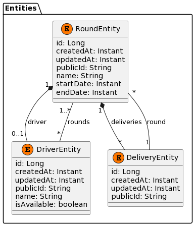

## Technologies utilisées

Le système de livraison est construit en utilisant les technologies suivantes :

- [Spring Boot](https://spring.io/projects/spring-boot): Spring Boot est un framework Java qui simplifie le développement d'applications Java en fournissant des conventions de configuration et des fonctionnalités prêtes à l'emploi.

- [PostgreSQL](https://www.postgresql.org/): PostgreSQL est un système de gestion de base de données relationnelle open-source et puissant. Il est utilisé pour stocker des données de manière fiable et performante.

- [Docker](https://www.docker.com/): Docker est une plateforme de conteneurisation qui facilite le déploiement d'applications dans des conteneurs logiciels.

### Problèmes rencontrés :

1. **Problème de ports non disponibles :** Lors de l'exécution de Docker, il est possible de rencontrer une erreur du type : "Error response from daemon: Ports are not available: exposing port TCP 127.0.0.1:5432 -> 0.0.0.0:0: listen tcp 127.0.0.1:5432: bind: An attempt was made to access a socket in a way forbidden by its access permissions." Cette erreur se produit lorsque le port 5432 est déjà utilisé localement. Pour résoudre ce problème, il est nécessaire de fermer le client PostgreSQL local avant de lancer le conteneur Docker.

2. **Problème de liaison sur toutes les interfaces :** Lors de la configuration des ports dans Docker, il est courant de lier le conteneur à l'adresse 0.0.0.0 plutôt qu'à 127.0.0.1. Cela est nécessaire car si l'on se limite à l'adresse 127.0.0.1, l'accès n'est possible qu'à l'intérieur du conteneur Docker. En utilisant 0.0.0.0, on permet également un accès depuis l'extérieur. Vous pouvez en apprendre davantage sur cette question en consultant : [https://stackoverflow.com/questions/46184173/err-empty-response-from-docker-container](https://stackoverflow.com/questions/46184173/err-empty-response-from-docker-container).

3. **Problème de dépendances circulaires :** : Résolu via une classe intermédiaire (source : https://stackoverflow.com/questions/29199677/design-class-circular-dependency)

# Actions

actions.yml : https://www.youtube.com/watch?v=a5qkPEod9ng
GitHub Marketplace : https://github.com/marketplace

## CI/CD pour le Système de Livraison (Back-end)

Ce référentiel contient les configurations pour le pipeline de CI/CD pour le système de livraison (back-end) de votre application. Le pipeline est automatisé à l'aide de GitHub Actions pour effectuer la construction, les tests et le déploiement de votre application.

### Configuration du Pipeline

Le pipeline est configuré pour déclencher des travaux sur les branches `develop`, `main`, et `integration`.

#### Démarrage Automatique

Les travaux sont automatiquement déclenchés à chaque `push` vers les branches suivantes :

- `develop`
- `main`
- `integration`

#### Travail de Construction

Le travail de construction est responsable de la compilation de l'application et de la création d'un package.

##### Étapes du Travail de Construction

1. **Vérification du Code**: Le code source est vérifié à partir du référentiel.
2. **Installation de la version Java 17**: Java 17 (Amazon Corretto) est installé pour construire l'application.
3. **Lancement des Tests**: Les tests de l'application sont exécutés.
4. **Construction de l'Application**: L'application est nettoyée et construite pour créer un package.
5. **Construction de l'Image Docker**: L'image Docker de l'application est construite mais n'est pas encore poussée.

#### Travail de Déploiement de l'Image Docker

Le travail de déploiement de l'image Docker est responsable de la création et du déploiement de l'image Docker de l'application.

##### Étapes du Travail de Déploiement de l'Image Docker

1. **Login to Docker Hub**: Connexion à Docker Hub en utilisant les informations d'identification sécurisées.
2. **Push Docker Image**: L'image Docker est poussée vers Docker Hub avec un tag approprié.

### Secrets

Pour que ce pipeline fonctionne correctement, vous devez définir les secrets suivants dans les paramètres de votre référentiel GitHub :

- `DOCKER_USERNAME`: Le nom d'utilisateur Docker Hub.
- `DOCKER_HUB_USERNAME`: Le nom d'utilisateur Docker Hub (pour la connexion).
- `DOCKER_HUB_ACCESS_TOKEN`: Le jeton d'accès Docker Hub (pour la connexion).

Assurez-vous de conserver ces secrets en toute sécurité et de les gérer correctement.

**Note**: Assurez-vous de garder vos secrets privés et sécurisés. Ne les partagez jamais dans un fichier README ou publiquement dans un référentiel. Utilisez les fonctionnalités de secrets de GitHub pour gérer ces informations en toute sécurité.

## Licence
Ce projet est publié sous la licence MIT. Pour plus d'informations, consultez le fichier LICENSE.

[](https://choosealicense.com/licenses/mit/)

# Crédits

- Exception Handler : https://medium.com/@sergiusac/custom-exception-handling-in-spring-boot-6b9a4666dbb5
- CI/CD : https://www.youtube.com/watch?v=a5qkPEod9ng
- Keycloack : https://www.keycloak.org/
- Désactivation du Keycloak : https://github.com/eugenp/tutorials/tree/master/spring-boot-modules/spring-boot-keycloak-2

# Informations complémentaires 

## Back-end

### Architecture

#### DTO

Séparer les objets pour chaque requête sur endpoint.
exemple :
```
POST - RoundCreateRequest round
PUT - RoundUpdateRequest round
```

#### Mappers
Les mappers ont pour objectifs de passer d'un état d'un objet à un autre état d'un autre objet.
Ils sont utilisés pour mapper des objets DTO(Data Transfer Object) de requêtes ou réponses vers un autre objet DTO(Data Transfer Object) de requêtes ou réponses ou entité (DriverEntity, RoundEntity, DeliveryEntity).

#### Seeders
Afin de remplir la base de données, il y a un seeding de la base de données via la classe DataLoader (src/main/fr/univrouen/deliverysystem/dataloader/DataLoader).
Cette classe utilise la dépendance Faker qui est un générateur de données aléatoires.

#### Tests

3. **Tests et Validation** : Tous les tests n'ont pas été implementés mais sont essentiels pour garantir le bon fonctionnement de l'application. Cependant, la mise en place de tests unitaires et de tests d'intégration demande du temps et des efforts supplémentaires.

## Difficultés Rencontrées

1. **Règle métier** :
E_TOU_60 : Le système doit empêcher l'association d'une tournée à un livreur si
celui-ci possède une tournée dont la date de début ou la date de fin est comprise dans la
tournée qu'on tente d'associer.

### Améliorations

- L'utilisation d'un UUID en clé primaire pour les entités au lieu d'une string publicId
@Id
@GeneratedValue(strategy = GenerationType.UUID)
@Column(name = "id", updatable = false, nullable = false)
private UUID id;

- Clean Architecture : https://www.baeldung.com/spring-boot-clean-architecture
- Hexagone Architecture : https://www.youtube.com/watch?v=e3K0_URBxRI&pp=ygUlaGV4YWdvbmUgYXJjaGl0ZWN0dXJlIGNvZGV1ciBlbiBzZWluZQ%3D%3D

#### Versionning de l'API

Source : https://stackoverflow.com/questions/389169/best-practices-for-api-versioning

#### Scalabilité

Ici, nous avons pas envisagé une quantité de données importantes,
et dans les sous attributs, nous pourrions avoir de la pagination
en plus de celle ajouter sur les 

#### Cache
La mise en place d'un cache pour les données statiques :
- https://spring.io/guides/gs/caching/
- https://www.baeldung.com/spring-cache-tutorial

#### Rate limiter 
La mise en place d'un contrôle de débit sur les endpoints de l'API.
- https://www.baeldung.com/spring-bucket4j
- https://spring.io/blog/2021/04/05/api-rate-limiting-with-spring-cloud-gateway

#### Profiles

L'utilisation de différents profil pour le développement, le test et la production :
- https://www.baeldung.com/spring-profiles
- https://www.baeldung.com/spring-profiles

#### Git-Flow

Le workflow : https://www.atlassian.com/fr/git/tutorials/comparing-workflows/gitflow-workflow
L'outil git flow : https://github.com/nvie/gitflow

#### Context Path
Une amélioration est de rajouter un préfixe au contexte de l'URL dans le application.properties :
- server.servlet.context-path=/api/insta_lite

#### Relation

##### Relation 1-n :

Pour ce projet, j'ai décidé de permettre à l'utilisateur d'effectuer la liaison des relations des deux côtés des entités.
Dans les relations 1-n, dans le JSON, il est possible de préciser du côté n, le tableau contenant tous les élements du côté 1.
Ainsi on y précise tous les foreign keys, or ce n'est pas une méthode à accomplir car :
- Requête trop lourde, il faut préciser dans la liste n, tous les élements à mettre jour ou à inserer qui correspond à la nouvelle clé étrangère
ou ne pas mettre les élements et donc il seront supprimé.
- Ne permet pas de prendre en compte la pagination sur les sous élements (Pagination on nested attributes)

Ainsi, pour une création ou un update, il faut le faire du coté de la clé étrangère (@ManyToOne = 1) et non pas du coté avec la List (@OneToMany = n) 
```
class ImageEntity {
	@Id
	@GeneratedValue(strategy = GenerationType.UUID)
	@Column(name = "id")
	private UUID id;
	private String name;
	private String description;
	private Instant publishedAt;
	private UserEntity user;
}

class UserEntity {
	@Id
	@GeneratedValue(strategy = GenerationType.UUID)
	@Column(name = "id")
	private UUID id;
	@Column
	private String username;
	@Column
	private String email;
	@Column
	private String password;
	List<ImageEntity> uploadedImages;
}

user: {
	"id": "aaaa-aaaa-1111",
	"username": "test",
	"email": "test@example.com",
	"role": "ADMIN",
}

image: {
	"id": "bbbb-bbbb-1111"
	"name": "",
	"description": "",
	"published_at": "",
	"user": {
		/**
		 * Précise l'UUID UUID qui sert de clé primaire dans la base de données
		 * car sinon au moment de save, JPA va effectuer un insert au lieu d'un update 
		 * car la clé primaire n'a pas été renseignée
		 */
		"id": "aaaa-aaaa-1111"
		"username": "test"
		"email": "test@example.com"
		"role": "ADMIN"
	}
}
```

##### Relation n-n :
Il faut utiliser la table d'association(=table de jointure) pour relier les clés étrangères des deux tables.

Supposons un utilisateur peut avoir plusieurs images et une image peut appartenir à plusieurs utilisateurs.
```
UserImageEntity {
	@Id
	@GeneratedValue(strategy = GenerationType.UUID)
	@Column(name = "id")
	private UUID id;
	@Column
	UserEntity userEntity;
	@Column
	ImageEntity imageEntity;
}

JSON pour insertion : {
	"user": {
		"id": "aaaa-aaaa-1111",
		"username": "test",
		"email": "test@example.com",
		"role": "ADMIN"
	},
	"image": {
		"id": "bbbb-bbbb-1111"
		"name": "",
		"description": "",
		"published_at": ""
	}
}

JSON pour update (précise l'id de la table de jointure UserImageEntity à update) : {
	"id": "cccc-cccc-1111",
	"user": {
		"id": "aaaa-aaaa-1111",
		"username": "test",
		"email": "test@example.com",
		"role": "ADMIN"
	},
	"image": {
		"id": "bbbb-bbbb-1111"
		"name": "",
		"description": "",
		"published_at": ""
	}
}
```
